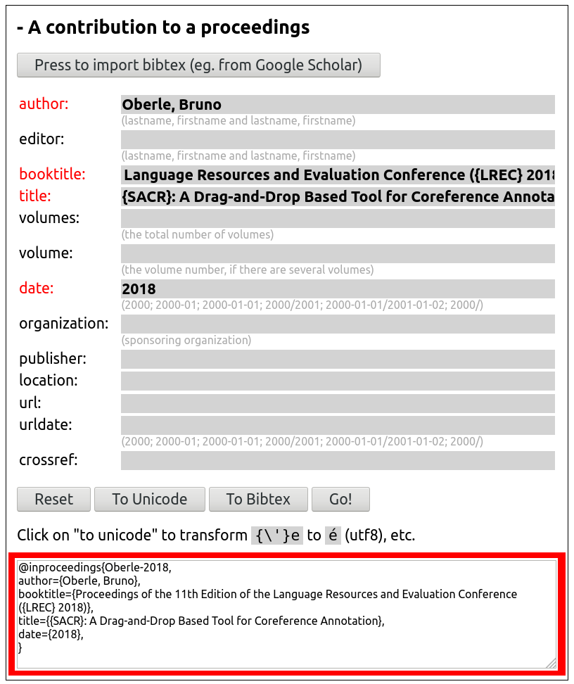
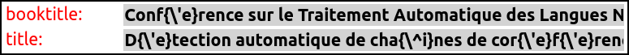
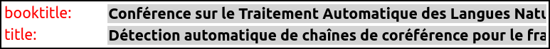
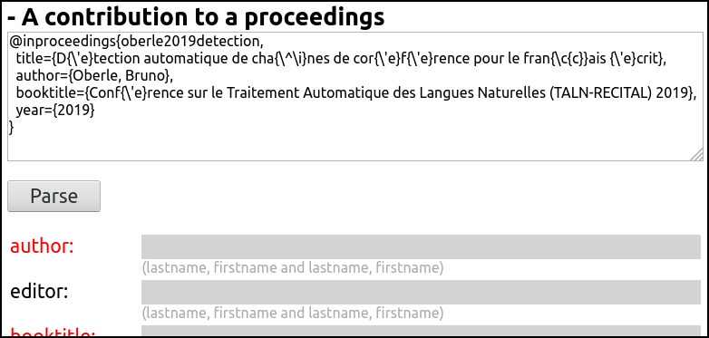
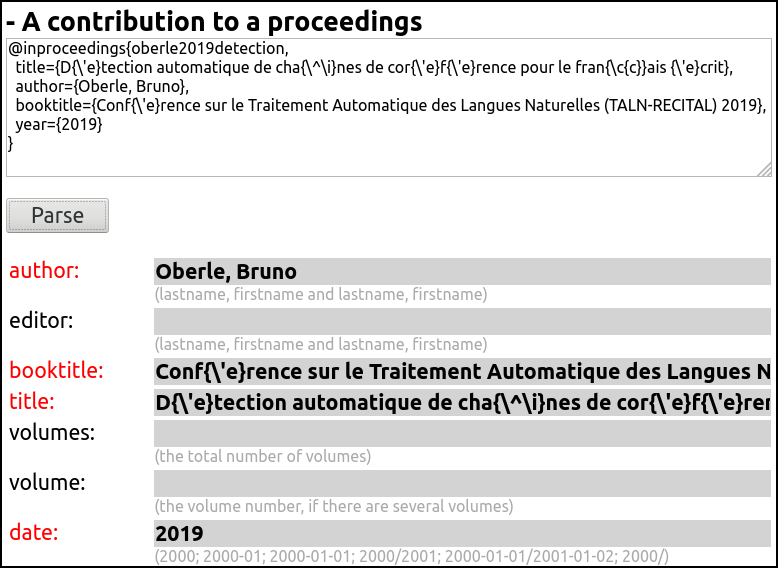
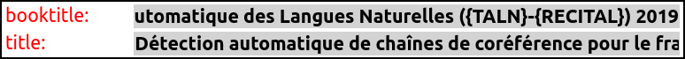
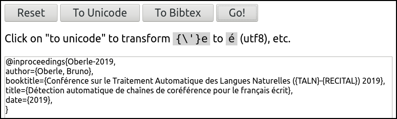

# Bib(la)tex Entry Generator

This javascript page is designed to quickly build bib(la)tex entries, including by formatting and correcting data from Google Scholar.

You can use it [online](http://boberle.com/projects/bibtex_entry_generator/bibtex_entry_generator/), or [download](https://github.com/boberle/bibtex_entry_generator/) the page `bibtex_entry_generator.html` and change it to fit your needs (see below how).

As is, it defines a (subset of) biblatex types and fields, but you can adapt it to bibtex if you prefer (see below).


## Usage

### Manually

Each entry type is defined by a set of fields, which you have to complete (required field are in red).  Press `Go!` to generate the bibtex code (here biblatex), framed red on the picture:



You see that the bibtex key is automatically generated from the author names and the date.

Biblatex accepts unicode, so there is no worries about diacritics.  If you prefer the bibtex style and don't want to manually write `{\'e}` for `é`, just entre 'é' and press the `To Bibtex` button: all the tranformations will be made automatically:



And the reverse is true with the `To Unicode` button.



The `To Unicode` button will also automatically surround upper case words with curly brackets: for example `LREC` to `{LREC}` in the first example.  If you want this feature for bibtex, just press `To Unicode` and then `To Bibtex`.


### With help of Google Scholar

Google Scholar is great as a starting point, but contains many, many errors.  You can use `bibtex_entry_generator` to correct them.

First, search a reference on Google Scholar and get the bibtex citation:

```
@inproceedings{oberle2019detection,
  title={D{\'e}tection automatique de cha{\^\i}nes de cor{\'e}f{\'e}rence pour le fran{\c{c}}ais {\'e}crit},
  author={Oberle, Bruno},
  booktitle={Conf{\'e}rence sur le Traitement Automatique des Langues Naturelles (TALN-RECITAL) 2019},
  year={2019}
}
```

On `bibtex_entry_generator`, press the `Press to import bibtex` button and paste the Scholar data in the box:



Press the `Parse` button, and the fields will be completed automatically:



If you use biblatex, which accepts unicode, press the `To Unicode` button to transform the bibtex style accents to unicode.  This will also surround upper case words with curly brackets (as `TALN` and `RECITAL`):



Now, just press on the `Go!` button to get the result, with an automatically computed bibtex key:




## Adapting to your needs

You can modify the javascript code to adapt it to your needs.  The entry types and fields are described in the page itself, just scroll down to the declaration of the `data_biblatex` variable.  It is an associative array, containing the various entry types you want to offer.

As an examaple, the default `article` type is defined as follows:


```javascript
   var data_biblatex = {

      article: {
         heading:     'An article',
         description: 'Press or research article.',
         author:        [null, REQ, null],
         title:         [null, REQ, null],
         journaltitle:  [['journal'], REQ, null],
         publisher:     [null, OPT, null],
         date:          [['year'], REQ, null],
         issuetitle:    [null, OPT, null],
         volume:        [null, OPT, null],
         number:        [null, OPT, null],
         issue:         [null, OPT, null],
         pages:         [null, OPT, null],
         url:           [null, OPT, null],
         urldate:       [null, OPT, null],
         crossref:      [null, OPT, null],
      },
...
}
```

Each type is an associative array:

- the `heading` key defines the heading in the html page,
- the `description` key defines the text between the heading and the actual fields,
- then there are the list of fields to be included in the entry.  The key is the name of the field (as it must appear in the bibtex code).  The value is an array of three value:
   - the first is either `null` or an array of values used when parsing bibtex code (e.g. from Google Scholar).  In the example above, which is designed to translate bibtex (from Scholar) to biblatex, `year` (bibtex) will be translated to `date` (biblatex).  It the value is `null`, no translation is done.
   - the second is either `REQ` (required) or `OPT` (optional),
   - the third is a custom description that appears below the field.  Note that description common for fields of various types are set in the `field_descriptions_biblatex` variable.

As an example, the `bibtex` version of the above `biblatex` example may be:

```javascript
   var data_biblatex = {

      article: {
         heading:     'An article',
         description: 'Press or research article.',
         author:        [null, REQ, null],
         title:         [null, REQ, null],
         journal:       [null, REQ, null],
         year:          [null, REQ, null],
         volume:        [null, REQ, null],
         number:        [null, OPT, null],
         month:         [null, OPT, null],
         pages:         [null, OPT, null],
         crossref:      [null, OPT, null],
      },
...
}
```


## Author

Hi! I'm Bruno Oberle, you can found more about me at [boberle.com](http://boberle.com).

